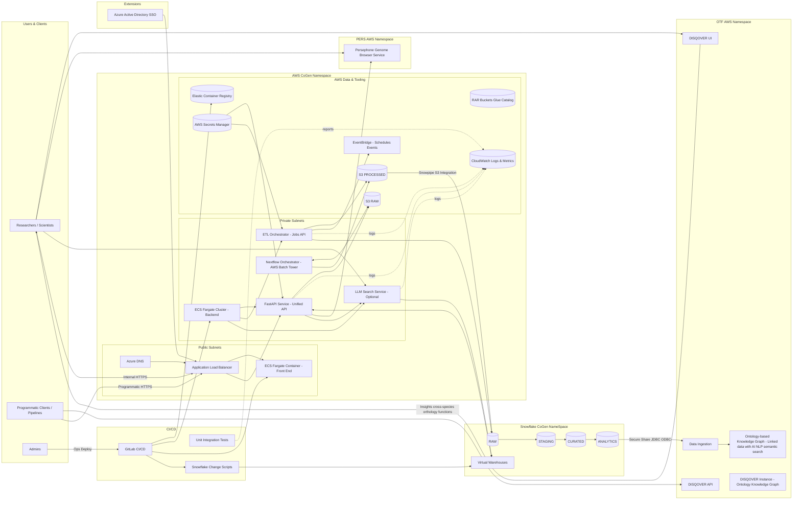

## CoGen Future State — Physical Deployment Architecture (Aug 2025)

### Technology Stack Overview
**Frontend Technologies:**
- React 18+ with TypeScript for enterprise-grade type safety and maintainability
- Material-UI or Ant Design for consistent, modern UI components
- Advanced genomic visualization libraries (D3.js, Plotly.js, Cytoscape.js)
- WebGL-based rendering for high-performance large-scale data visualization
- Progressive Web App (PWA) capabilities for enhanced user experience

**Backend Technologies:**
- Python 3.11+ with FastAPI framework for high-performance async REST APIs
- Pydantic v2 for robust data validation, serialization, and automatic API documentation
- SQLAlchemy 2.0 with async support and Snowflake connector for database operations
- Celery with Redis cluster for distributed asynchronous task processing
- LangChain integration for LLM-powered natural language query capabilities

**Data Platform:**
- Snowflake Data Cloud with advanced features (Time Travel, Zero-Copy Cloning, Snowpark)
- AWS S3 with intelligent tiering and lifecycle management for cost-effective data storage
- Nextflow with Tower for enterprise-grade bioinformatics pipeline orchestration
- Apache Spark for large-scale genomic data processing and analytics

**AI & Knowledge Discovery:**
- Ontoforce DISQOVER for ontology-based knowledge graphs and semantic search
- Large Language Models (OpenAI GPT-4/Azure OpenAI) for natural language genomic queries
- Vector databases (Pinecone/Weaviate) for semantic similarity search
- Persephone Genome Browser for multi-genome comparative visualization

**Infrastructure & DevOps:**
- AWS ECS Fargate for serverless containerized microservices deployment
- Docker multi-stage builds for optimized container images and consistent environments
- GitLab CI/CD with comprehensive testing, security scanning, and automated deployments
- Terraform for Infrastructure as Code (IaC) and reproducible deployments

**Security & Monitoring:**
- Azure Active Directory for enterprise SSO, RBAC, and identity management
- AWS Secrets Manager with automatic rotation for secure credential management
- AWS CloudWatch, Prometheus, and Grafana for comprehensive monitoring and alerting
- Zero-trust security architecture with AWS Security Hub and GuardDuty

The target physical deployment for CoGen based on the Aug 2025 proposal and stakeholder sessions:
- Core data platform on Snowflake (RAW → STAGING → CURATED → ANALYTICS)
- AWS for application runtime, pipelines, storage, and CI/CD
- Ontoforce DISQOVER (SaaS) as the ontology-based knowledge graph and semantic search layer for discovery and cross-dataset insights
- Read-only phase supported by curated views and APIs while features migrate incrementally

### Notes & Rationale
- DISQOVER is deployed within the AWS private subnet as an on-premise instance, providing ontology-based knowledge graph and semantic discovery across curated CoGen datasets with direct access to Snowflake analytical views.
- Snowflake remains the single source of truth with staging and curated schemas; Snowpipe from S3 handles scalable landing of processed pipeline outputs.
- AWS hosts runtime: unified API (FastAPI), ETL orchestrator, optional LLM search service, and Nextflow orchestration. Persephone genome browser and DISQOVER operate in separate namespaces. Frontend is served via ECS behind ALB; private services run on ECS Fargate in private subnets.
- Internal-only deployment: Azure DNS for domain resolution, no external CDN/WAF as this is an internal enterprise application accessed via corporate network through ALB.
- CI/CD uses GitLab CI/CD to publish containers to ECR, deploy ECS tasks, push static site builds, and apply Snowflake change scripts.
- Secrets Manager, CloudWatch, and EventBridge provide secure configuration, observability, and job scheduling. Azure Active Directory provides enterprise SSO integration for user authentication and authorization.

