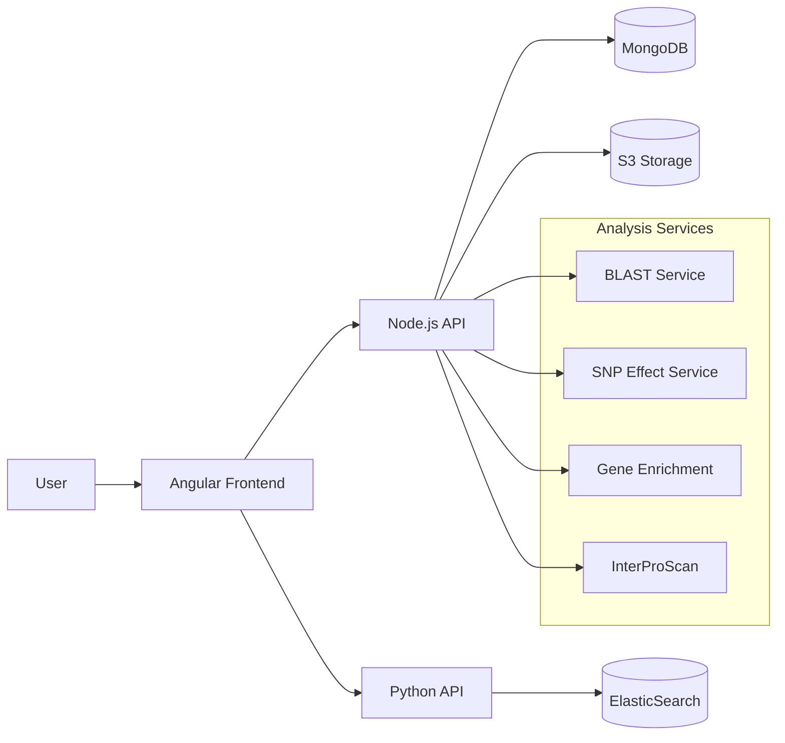
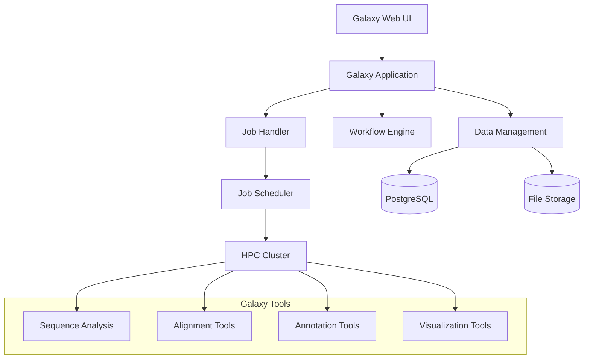
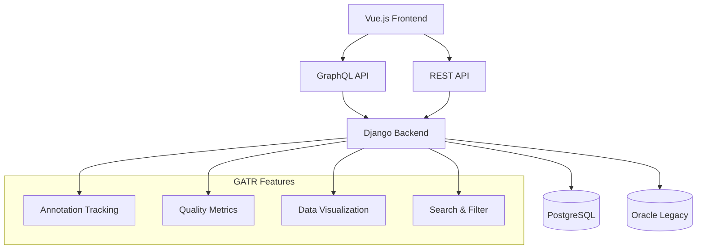
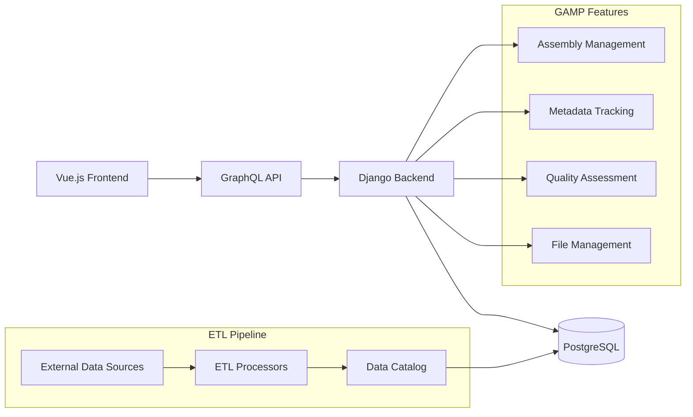
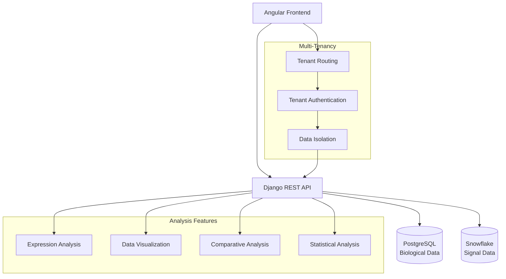
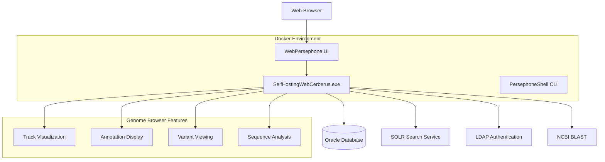
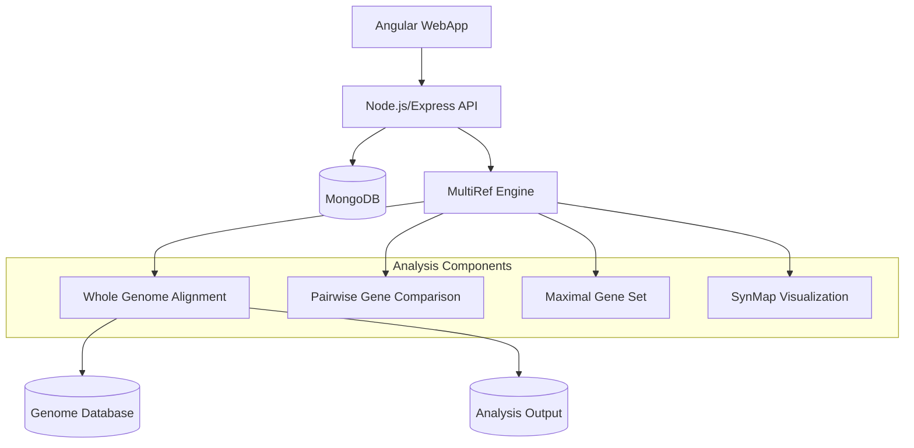
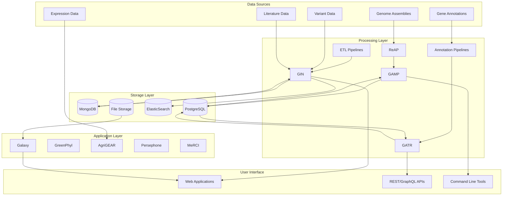

# CoGen Collection - Comprehensive Bioinformatics Platform

## Executive Summary

The CoGen (Comprehensive Genomics) Collection is a sophisticated bioinformatics ecosystem developed by Syngenta for genomic analysis, annotation, and visualization. This platform comprises 11 major applications and numerous supporting tools that collectively form an integrated genomics data infrastructure serving researchers and scientists in plant genomics and agricultural biotechnology.

## Overall Architecture

```mermaid
flowchart TB
    subgraph "Data Layer"
        MongoDB[(MongoDB/DocumentDB)]
        PostgreSQL[(PostgreSQL)]
        ElasticSearch[(ElasticSearch/OpenSearch)]
        Oracle[(Oracle DB)]
        Snowflake[(Snowflake)]
        S3[(S3 Storage)]
        FileSystem[(EFS/File Systems)]
    end
    
    subgraph "Core Applications"
        GIN[GIN - Gene Information Network]
        Galaxy[Galaxy Suite]
        GATR[GATR - Genome Annotation Tracker]
        GAMP[GAMP - Genome Assembly Platform]
        GreenPhyl[GreenPhyl - Phylogenetic Analysis]
        AgriGEAR[AgriGEAR/Genevestigator]
        Persephone[Persephone - Genome Viewer]
        MeRCI[MeRCI - Genome Comparison]
        ReAP[ReAP - Reference Annotation]
    end
    
    subgraph "Supporting Tools"
        BLAST[BLAST/Diamond Tools]
        SnpEff[SNP Effect Prediction]
        InterPro[InterProScan]
        GSEA[Gene Set Enrichment]
    end
    
    subgraph "Infrastructure"
        AWS[AWS ECS/EC2]
        Docker[Docker Containers]
        Ansible[Ansible Automation]
        CI_CD[CI/CD Pipelines]
    end
    
    %% Data connections
    MongoDB --> GIN
    PostgreSQL --> GATR
    PostgreSQL --> AgriGEAR
    ElasticSearch --> GIN
    Oracle --> Persephone
    Snowflake --> AgriGEAR
    S3 --> Galaxy
    FileSystem --> Galaxy
    
    %% Application interconnections
    GIN <--> GreenPhyl
    GATR <--> Persephone
    GAMP <--> Galaxy
    MeRCI <--> Galaxy
    
    %% Supporting tool connections
    BLAST --> GIN
    SnpEff --> GIN
    InterPro --> GIN
    GSEA --> GIN
    
    %% Infrastructure
    AWS --> Galaxy
    AWS --> GIN
    AWS --> GATR
    Docker --> Galaxy
    Docker --> Persephone
    Ansible --> Galaxy
```

## Critical Business Data

### 1. **Genomic Data Assets**
- **170+ species** with genomic assemblies and annotations
- **15+ million gene cards** with functional annotations
- **Comprehensive gene family relationships** (orthologs, paralogs, homologs)
- **Multi-omics data integration** (expression, variants, epigenomics)
- **Reference databases** for BLAST, InterPro, and pathway analysis

### 2. **Data Types Managed**
- Genome assemblies (FASTA sequences)
- Gene annotations (GFF/GTF files)
- Protein sequences and domains
- Gene expression data matrices
- Variant calls and effect predictions
- Phylogenetic trees and relationships
- Functional annotations and pathways
- Literature and publication links

### 3. **User Base & Usage**
- Syngenta researchers and scientists
- Plant breeding programs
- Genomics analysis pipelines
- Agricultural biotechnology projects
- Cross-species comparative studies

## Platform Components

### 1. **GIN (Gene Information Network)** 🧬
**Purpose**: Functional genomic search engine and gene information hub

**Technology Stack**:
- **Frontend**: Angular
- **Backend**: Node.js, Python
- **Database**: MongoDB (DocumentDB), ElasticSearch
- **Infrastructure**: AWS ECS, S3

**Architecture**:

**Key Features**:
- Gene-centric search across 170+ species
- Variant effect prediction integration
- Gene family and ortholog relationships
- Functional annotation aggregation
- Literature and pathway associations
- Watch functionality for gene tracking

**Business Value**: Central hub for gene discovery and functional analysis, supporting breeding decisions and research priorities.

---

### 2. **Galaxy Suite** 🔬
**Purpose**: Comprehensive bioinformatics platform for genomic analysis workflows

**Technology Stack**:
- **Core**: Python (Galaxy framework)
- **Frontend**: Vue.js, Mako templates
- **Database**: PostgreSQL
- **Job Execution**: Slurm, SGE schedulers
- **Infrastructure**: Ansible automation, Docker

**Architecture**:

**Key Features**:
- Tool-based modular architecture
- Workflow automation and reproducibility
- HPC integration for large-scale analysis
- Shared infrastructure and reference data
- CI/CD automated deployment

**Business Value**: Enables reproducible, scalable genomic analysis workflows supporting research and breeding programs.

---

### 3. **GATR (Genome Annotation Tracker)** 📊
**Purpose**: Genome annotation tracking and visualization platform

**Technology Stack**:
- **Frontend**: Vue.js with UIKit
- **Backend**: Django with GraphQL
- **Database**: PostgreSQL (primary), Oracle (legacy)
- **APIs**: GraphQL, REST endpoints

**Architecture**:

**Key Features**:
- Genome annotation tracking and quality metrics
- Integration with Persephone for visualization
- Multi-database support (PostgreSQL/Oracle)
- GraphQL API for flexible data queries
- Automated CLI tools for data management

**Business Value**: Provides comprehensive tracking of genome annotation quality and availability, supporting data governance and research planning.

---

### 4. **GAMP (Genome Assembly and Mapping Platform)** 🗂️
**Purpose**: Genome assembly catalog and metadata management

**Technology Stack**:
- **Frontend**: Vue.js
- **Backend**: Django with GraphQL
- **Database**: PostgreSQL
- **ETL**: Python data pipelines

**Architecture**:

**Key Features**:
- Comprehensive genome assembly catalog
- Assembly statistics and quality metrics
- File location and availability tracking
- Species and line metadata management
- ETL pipelines for data synchronization

**Business Value**: Central repository for genome assembly information, enabling efficient data discovery and access across research projects.

---

### 5. **GreenPhyl** 🌳
**Purpose**: Phylogenetic analysis and gene family clustering platform

**Technology Stack**:
- **Framework**: Django
- **Frontend**: Django templates with JavaScript
- **Database**: PostgreSQL
- **Analysis**: Python bioinformatics libraries

**Key Features**:
- Protein sequence clustering into gene families
- Phylogenetic tree construction and visualization
- Ortholog and paralog relationship identification
- Cross-species gene function annotation
- External database cross-referencing

**Business Value**: Enables comparative genomics and gene function prediction across plant species, supporting breeding and gene discovery programs.

---

### 6. **AgriGEAR/Genevestigator** 📈
**Purpose**: Gene expression data analysis and visualization platform

**Technology Stack**:
- **Frontend**: Angular with RxJS state management
- **Backend**: Django REST API
- **Databases**: PostgreSQL (biological data), Snowflake (signal data)
- **Architecture**: Multi-tenant, layered design

**Architecture**:

**Key Features**:
- Multi-tenant gene expression data platform
- Advanced visualization and statistical analysis
- Cross-experiment and cross-species comparisons
- Intuitive Angular-based user interface
- Scalable data architecture separating biological and signal data

**Business Value**: Provides insights into gene expression patterns and regulatory networks, supporting functional genomics research and breeding decisions.

---

### 7. **Persephone** 👁️
**Purpose**: Genome browser and visualization platform

**Technology Stack**:
- **Application**: .NET (SelfHostingWebCerberus.exe)
- **Frontend**: WebPersephone UI
- **Database**: Oracle, MySQL
- **Services**: SOLR search, LDAP authentication, BLAST integration
- **Deployment**: Docker containers

**Architecture**:

**Key Features**:
- Interactive genome browser with multiple track support
- Integration with annotation and variant data
- BLAST sequence alignment capabilities
- User authentication and access control
- Dockerized deployment for consistency

**Business Value**: Provides intuitive genome visualization capabilities for researchers, enabling detailed examination of genomic features and variants.

---

### 8. **MeRCI (Multi-assembly Reference Comparison Initiative)** 🔄
**Purpose**: Comparative genomics platform for whole genome alignment and analysis

**Technology Stack**:
- **Frontend**: Angular
- **Backend**: Node.js/Express API
- **Database**: MongoDB
- **Analysis Engine**: Python (MultiRef)
- **Visualization**: SynMap

**Architecture**:

**Key Features**:
- Whole genome alignment between multiple assemblies
- Pairwise gene comparison analysis
- Synteny visualization and analysis
- Assembly and species management
- Comparative genomics workflows

**Business Value**: Enables comparative genomics analysis across species and assemblies, supporting evolutionary studies and breeding program decisions.

---

### 9. **ReAP (Reference Annotation Pipeline)** 🧬
**Purpose**: Gene prediction and annotation pipeline

**Key Features**:
- Automated gene prediction pipelines
- NextFlow workflow management
- Quality assessment and validation
- Integration with genome assemblies

**Business Value**: Provides standardized, high-quality gene annotations essential for all downstream genomic analyses.

---

## Supporting Tools and Infrastructure

### **Bioinformatics Tools**
- **BLAST/Diamond Tools**: Sequence similarity search
- **Gene Set Enrichment Analysis**: Functional pathway analysis
- **InterProScan**: Protein domain and function prediction
- **SNP Effect Prediction**: Variant impact analysis
- **Chip Annotation Tools**: Microarray analysis support

### **Infrastructure Components**
- **AWS Infrastructure**: ECS, EC2, S3, DocumentDB, OpenSearch
- **Docker Containerization**: Consistent deployment environments
- **Ansible Automation**: Infrastructure as code
- **CI/CD Pipelines**: Automated testing and deployment
- **BioPerl Libraries**: Perl-based bioinformatics tools

## Data Flow and Integration

## Technology Stack Summary

### **Frontend Technologies**
- Angular (GIN, MeRCI, AgriGEAR)
- Vue.js (Galaxy, GATR, GAMP)
- Django Templates (GreenPhyl)

### **Backend Technologies**
- Node.js/Express (GIN, MeRCI)
- Python/Django (GATR, GAMP, GreenPhyl, AgriGEAR)
- .NET (Persephone)
- Python/Galaxy Framework (Galaxy)

### **Databases**
- MongoDB/DocumentDB (GIN, MeRCI)
- PostgreSQL (GATR, GAMP, GreenPhyl, AgriGEAR)
- ElasticSearch/OpenSearch (GIN)
- Oracle (Persephone - legacy)
- Snowflake (AgriGEAR - signal data)

### **Infrastructure**
- AWS (ECS, EC2, S3, DocumentDB, OpenSearch)
- Docker containers
- Ansible automation
- CI/CD pipelines
- HPC clusters (Slurm, SGE)

## Security and Data Governance

### **Authentication & Authorization**
- LDAP/Active Directory integration
- JWT token-based authentication
- Role-based access control
- Multi-tenant data isolation

### **Data Security**
- TLS/SSL encryption in transit
- Data encryption at rest
- Input validation and sanitization
- Protection against common web vulnerabilities

### **Compliance**
- Data residency requirements
- Access auditing and logging
- Backup and disaster recovery
- Regulatory compliance frameworks

## Business Impact and Value

### **Research Acceleration**
- Centralized access to 170+ species genomic data
- Integrated multi-omics analysis capabilities
- Reproducible workflows and analyses
- Cross-platform data integration

### **Breeding Program Support**
- Gene discovery and prioritization
- Marker-trait association analysis
- Comparative genomics across species
- Expression-based breeding decisions

### **Operational Efficiency**
- Automated data pipelines
- Standardized analysis workflows
- Cloud-based scalable infrastructure
- Reduced time from data to insights

### **Scientific Excellence**
- High-quality annotations and predictions
- Comprehensive functional genomics platform
- State-of-the-art bioinformatics tools
- Publication-quality visualization capabilities

## Future Roadmap and Evolution

### **CoGen Initiative**
The platform is evolving toward a unified Comprehensive Genomics Database (CoGen) that will:
- Centralize all genomic data and metadata
- Provide unified APIs across all applications
- Implement microservices architecture
- Enhance cloud-native capabilities
- Improve data governance and quality

### **Technology Modernization**
- Migration to cloud-native architectures
- Implementation of microservices patterns
- Enhanced automation and DevOps practices
- Modern UI/UX frameworks adoption
- API-first design principles

This comprehensive bioinformatics platform represents a significant investment in genomic research infrastructure, providing Syngenta with competitive advantages in plant breeding, gene discovery, and agricultural innovation. The integrated nature of these applications creates synergies that amplify the value of individual components while providing researchers with a powerful, cohesive toolset for genomic analysis.